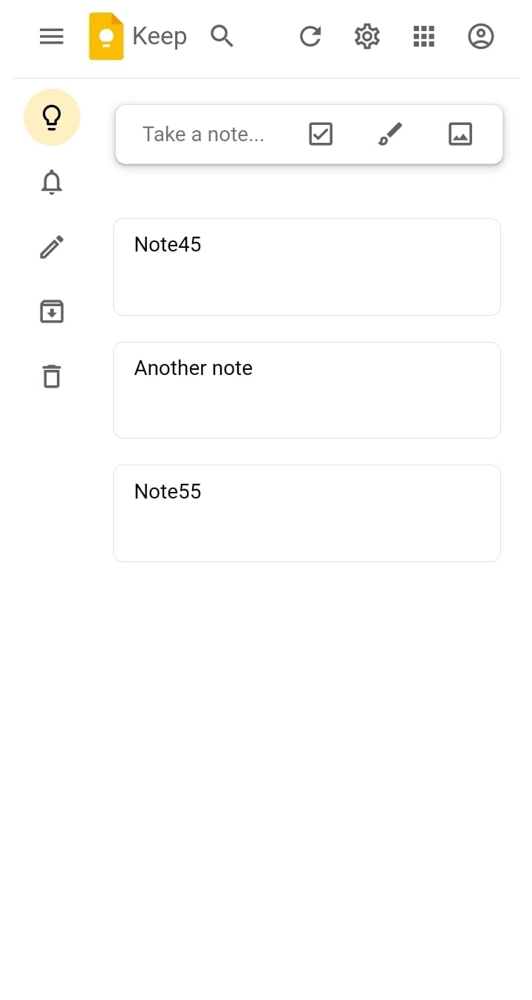

# Google Keep Clone

> Make a note , save it, edit and/or delete it.

---

### Table of Contents

- [Description](#description)
- [Reference(s)](#references)
- [Developer Info](#developer-info)

---

## Description

This is my Google Keep clone , I Used HTML, CSS , JAVASCRIPT , OOP & DOM to execute it. You're able to write a note, edit it and delete it. I used local storage to save it, if you refresh you will see the note won't dissapear. It is also mobile responsive.

#### Language(s):

- Javascript
- OOP
- DOM
- HTML
- CSS

[Back To The Top](#google-keep-clone)

---

## Reference(s)

- Google Keep - [Google Keeep Clone](https://nkanyiso-google-keep-dom-js.netlify.app/)

[Back To The Top](#google-keep-clone)

---

## Developer Info

- Portfolio - [Nkanyiso's Portfolio](https://nkanyiso-portfolio.netlify.app/)

[Back To The Top](#google-keep-clone)
